# 2048-3*4模式攻略（4096不是梦）

---闪电小雷友

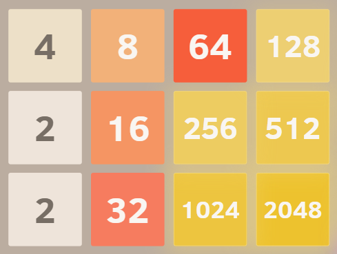 

[TOC]

## 前言＆基础术语

### 前言

本攻略为变种2048的3*4模式攻略，目标是在12格空间内合成4096（无撤销）。

本攻略建议有一定基础的玩家阅读（最好能独立在3*4模式合成1024）

祝早日合成4096~

### 基本术语

**棋盘编码（3*4模式）：**

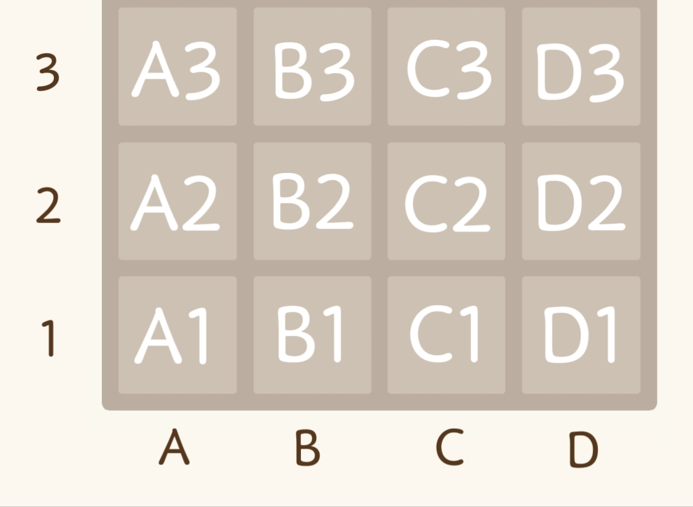 

**A列：**顾名思义，A1 A2 A3所在列

**1号位：**本攻略中默认是A1 B1 C1 D1

**顶层**：本攻略中指A列

**次顶层**：本攻略中指B列

**灭顶：**只有一个方向可以移动导致被迫乱阵

**滑出**：大数被迫移动，且新出数阻止了大数回到原来的位置。简称滑。

**强滑**：可以不滑出，但是不滑出就会死，或者活的概率很低。

**连消**：同一行一步发生两个合并。

**0**：如果一个位置没有数字，我们有时用 0 代替。

**活率（胜率）**：按最优解走，合成目标数字的概率。

**赌** **2**：下一步需要出 2 才能活，或如果出 4 则活率非常低。本文中出 2 的概率为 90%。

**赌半个** **2**：有大约一半的概率赌 2；或者下一步如果出 4，则活率大约下降至出 2 的一半。

**赌** **1%**：有大约 1%的概率立刻死。赌 5%同理。

**缓冲**：可以用于化解部分不利局面，从而增加活率。简称缓。

（感谢SMCU有些我直接复制过来了qwq）

## 一、阵型介绍

作者喜欢右下底（即大数堆在右下角）。如果不是右下底其实也同理~

### 1、两大数阵型

**（1）下底排布（442）**

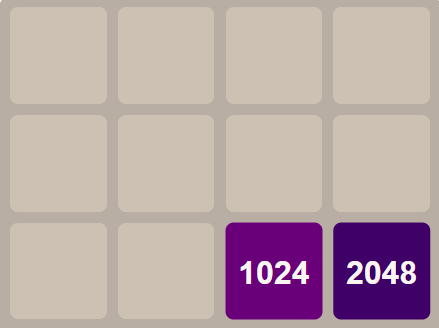 

**（2）右底排布（433）**

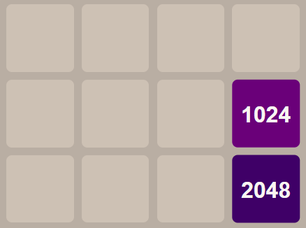 

### 2、三大数阵型

**（1）下底三大数（441）**

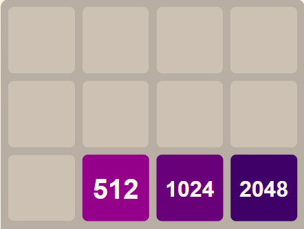 

**（2）L排布(432)**

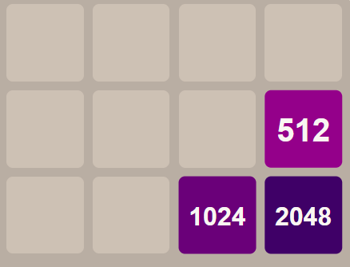 

**（3）右底层叠（333）**

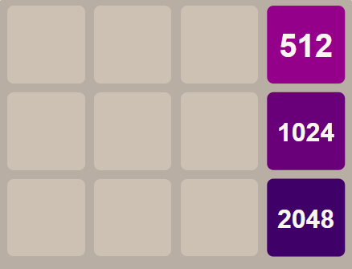 

**(4)reverseL(423)**

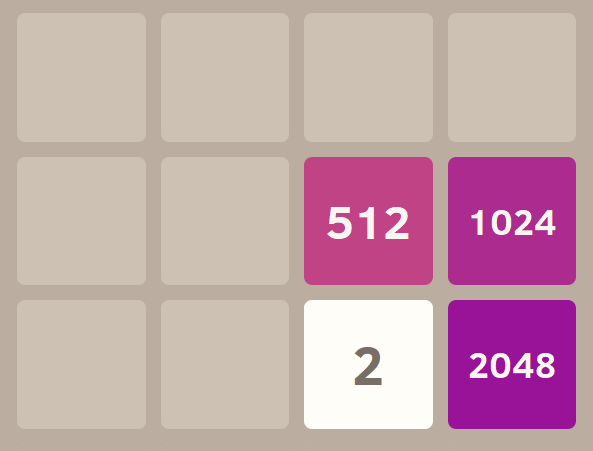 

### 3、四大数阵型

**（1）下底层叠（44）**

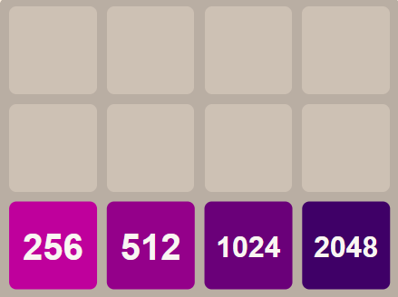 

**（2）431**

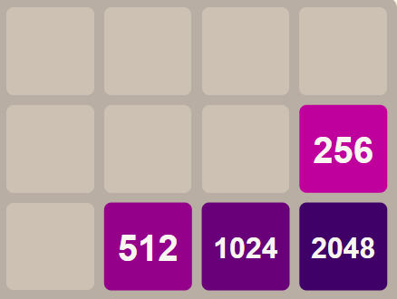 

**（3）L2**

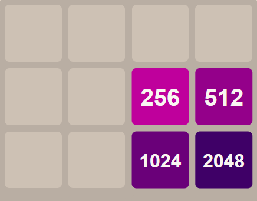 

**(4) 332**

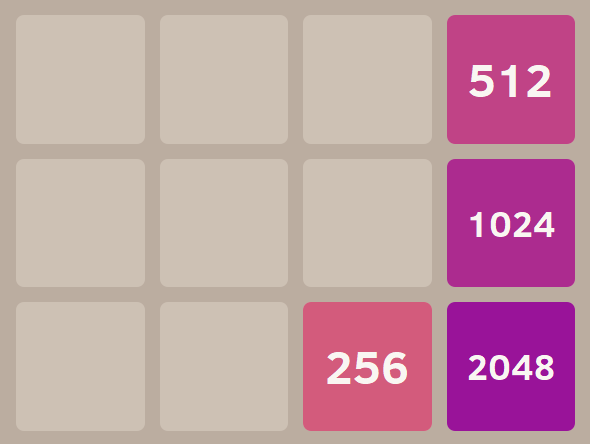 

### 4.阵型转化关系

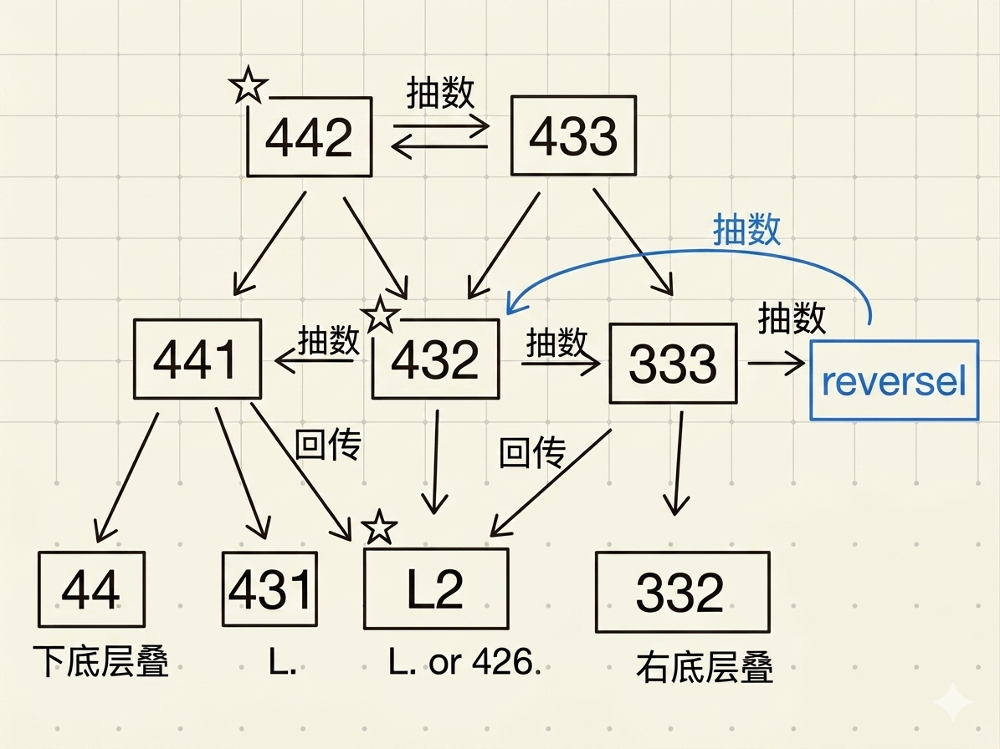 

推荐按照最优路线走法（AI走法）：**442→432→L2**（已在图上标⭐）

除此之外如果喜欢下底层叠，可以考虑**442→441→（回传）L2**

如果喜欢右底层叠，也可以**433→333→（回传）L2**

**AI成功率（四大数）：**

L2：0.525

332：0.505

431：0.433

44：0.333

## 二、432路线

432路线的选择涉及到成功率，所以还是很重要的

### 1. L2的两种做法

**42L**

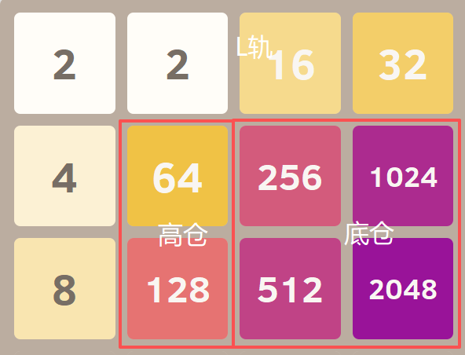 

右下角四格为**底仓**（也可按44划分成底仓和中仓但我觉得没必要）

B1 B2两格为**高仓**

其它的组成**L轨**。其中L轨上面四格组成**横轨**，左边三格组成**纵轨**

将四大数拼到右下角4格之后，第五第六的大数放在高仓，这个做法被命名为**42L**

**426**

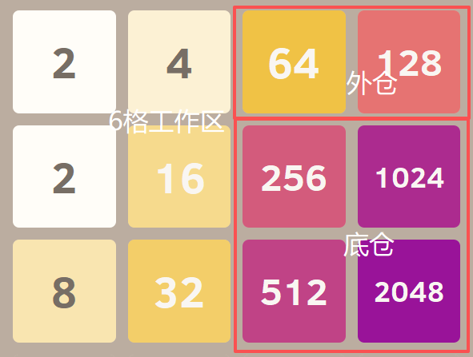 

右下四格为**底仓**

C3 D3两格为**外仓**

其余A列B列6格组成**6格工作区**，往往需要两排定式（也可以叫两列定式）

将四大数拼到右下角4格之后，第五第六的大数放在外仓，这个做法被命名为**426**

一般而言 426成功率更高，但是42L更通用。426填缝失败时往往意味着被迫转42L

**AI成功率（L2)：**

8格64：426与42L几乎都必出

8格128：426：0.985   42L：0.95    （差三个半点）

8格256：426：0.54     42L：0.44      （差十个点）

### 2.432路线

为了追求更高的成功率,432往往采用以下路线：

8格64：用42L（更好铺垫426-128）

8格128：用426

8格256：用426

**8格64铺垫：**

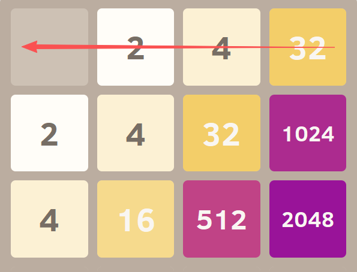 

先把C2和D3填成32

然后找机会将D3传到C列合并，同时铺垫42L

随后做42L-64

**8格128铺垫：**

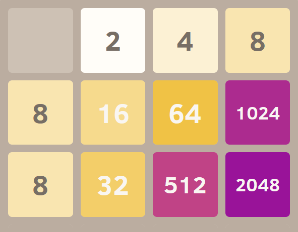 

走出8 8 16 32后，尽量往缝里填数，然后铺垫426-128

**8格256铺垫：**

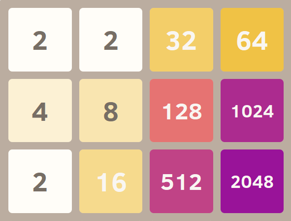 

最后两排32尽量走出回传型

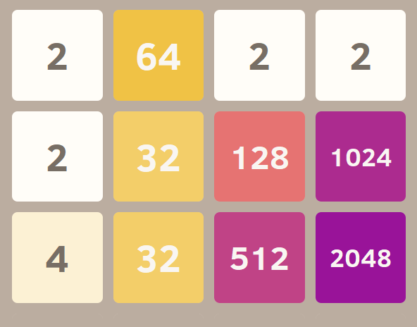 

回传后希望能将32 64传到B列，把外仓空出，然后填外仓铺垫426-256

当然铺垫过程还有很多细节，这里不作过多介绍

## 三、两排32、两排64

两排定式也可以叫两列定式。本攻略一律叫两排

两排32和两排64出现频率不高。两排32出现在2k与4k残局；而两排64只出现在4k残局，也就是只在最后合4k的时候用到。这两种残局情况少，记忆较为简单，但是不容得出现错误（否则会掉很多吻合度）。所以推荐大家先掌握这两类残局。

### 1、禁回传两排32

两排32非常简单，最重要的是合出16之后的**防滑**

**首先牢记以下几个局面的成功率排序**（递增）：

      

  

图1走右更好，原因是对4的抗性更好。（注：A3B3是16 8,  8 4 均是走上）

图2走右，无论出2还是出4都是必出32。而走上有可能在次顶出4，情况很糟。

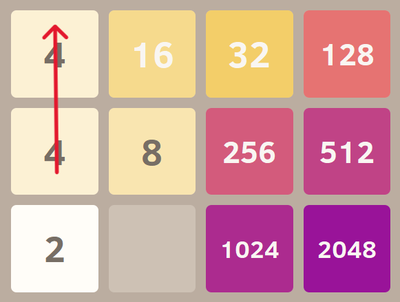 

如果出4，有可能走出以上的局面，切记此时走上而不走右

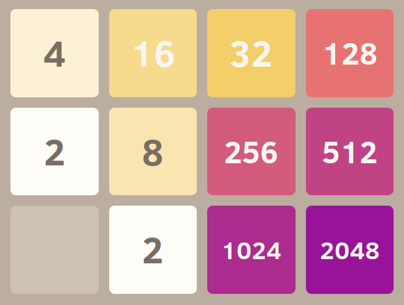 

上图是很坏的一种强灭形。所以警惕16 8 2。次顶层8比顶层8更可怕

**合16阶段的变招*：**

tips:可以先学完两排16再把这一部分补上

    

为了避免844，以上情况均改走下

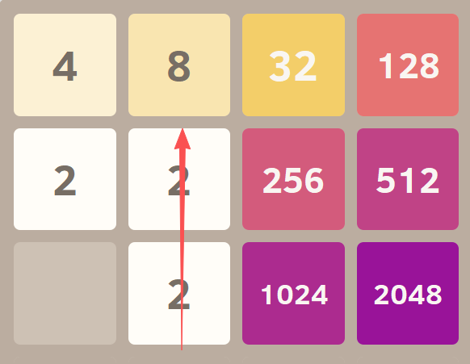 

这里走上更好，而两排16是走右

### 2、两排32铺垫两排64

**1.**

  

此处先上再下

值得注意的是两排64这里要先下再上

**2.**

  

这里很有说法

铺垫两排64时先下后右

做两排64时先上再下填8

如果缝是32,64（即双缩填缝）则直接右上上

出现了三种不同走法

**3.**

  

如果走出这种情况，不用右继续卡数，直接上

### 3、两排64（free)

两排64和两排32的思路几乎一致，**防滑**为头等大事

其次，两排64末尾往往面临着赌对半，所以多**争取对半机会**是很重要的

先两排32，然后凭感觉走，

比如：

  

此时有三次赌对半机会。如果在A2出2，则上右出16后还有两次。

#### final32

    

图1走右，和两排32相同

图2与两排32不同，走上比走右更好。原因是有可能多争取到赌对半机会

 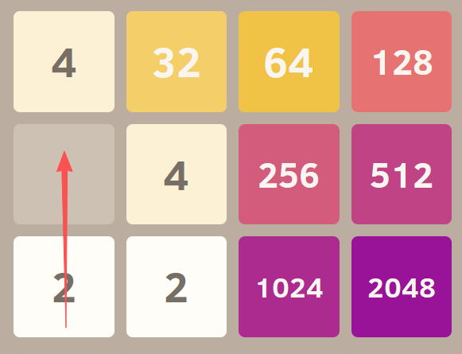   

图一 走上赌2，大概率能规避对半。如果再出2，走右

图二 这里虽然走上能规避赌对半，但最优解是直接走下，不赌2

#### 变招：

1.

  

此处直接走上，与两排32不同

2.

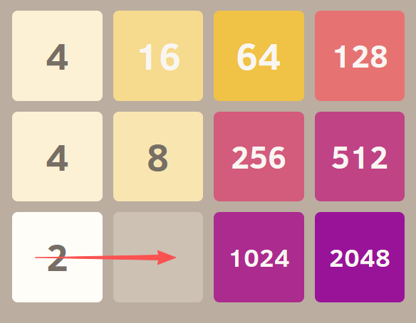 

此处走右，与两排32不同

### 4、两排带回传32

**注：**带回传32出现于第四大数从128到256的过程，而final256中不使用

带回传32时，16放在1号位更好，做Z型排列

与固定位两排32最大的不同点：由于回传的允许，16 8 2成为了好型，顶层8反而会影响回传而不好

#### （1）1号位16（z型）

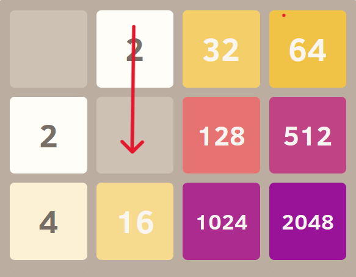  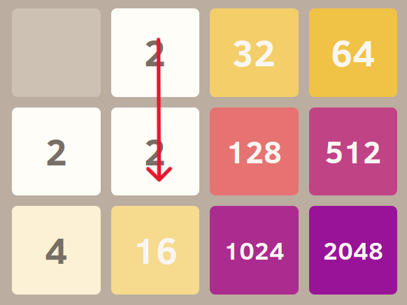  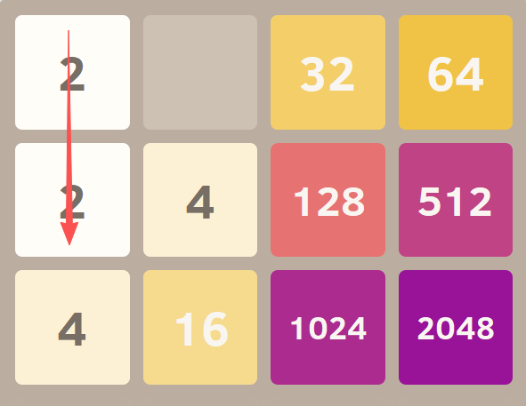

图1走下，与固定位两排32不同，因为顶层出8不好

图2继续走下，与图1同理

两个2置于图3的形状是最优的，然后下右，准备回传

#### （2）3号位16（s型）

如果16在3号位笔者建议一律按禁回传走法

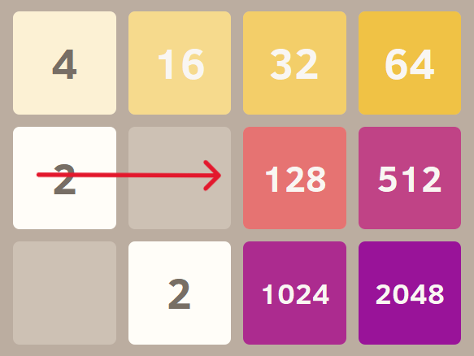 

此图的最优解是走上，但是上和右差别不大

笔者的建议是按照禁回传走法，走右

因为走上的话如果出4，AI会选择抽四大数，而人类对此把握并不高。

#### （3）铺垫带回传32*

tips:建议先学完两排16铺垫后再回来补充此部分~

**1.**

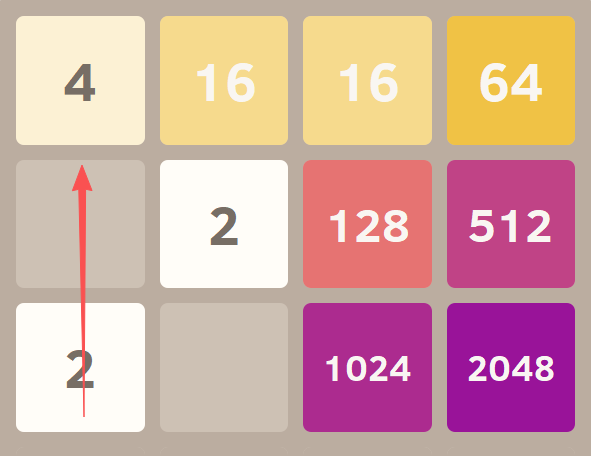  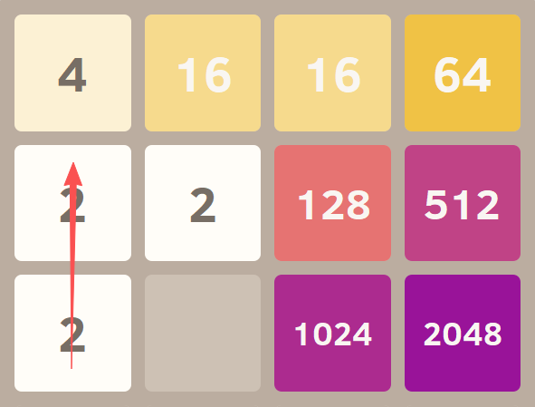  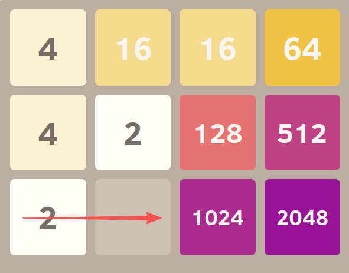

图1走上，与铺垫一排16一样。若A1出2，则继续走上（图2）

图3不走上，改走右。然后若A1出2则走成唤鸡。若A3出2则走下

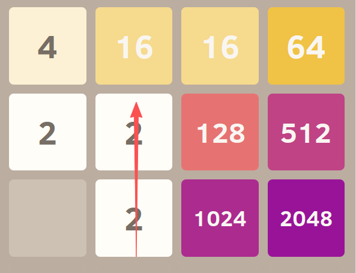  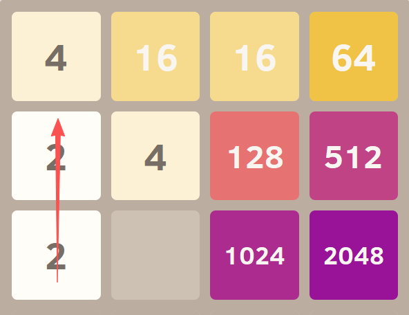  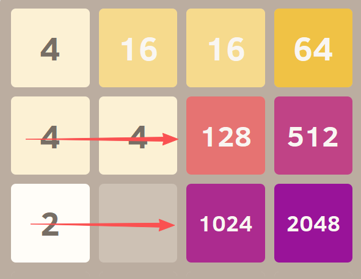

如果在B1出2，形成**形6**，这里改走上。如果在B1再出2，可以改走下规避**形9**

如果在A1出2，则继续走上。然后出2就走右（注：B1出4可以改走下）

**2**

  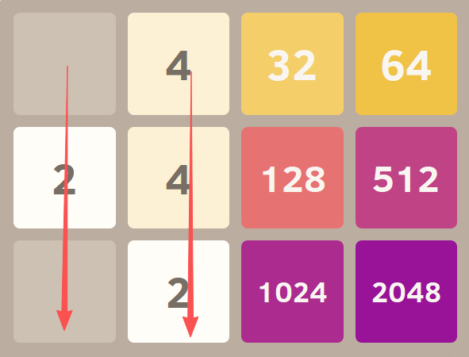

此处走右（与两排32走不同），然后下右做反向z84

**3.**

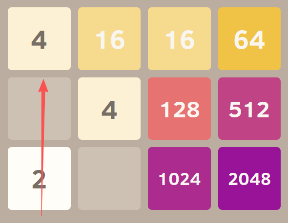  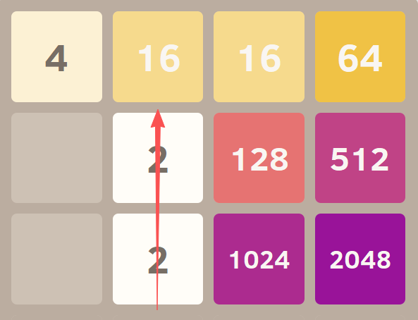 

此为**形7**＆**形8**，都改走上，因为**形9** 有下的应对而成为好形

铺垫完了之后，用相反的两排16定式即可(想象16在C1)

#### （4）回传部分处理

如果不慎未能将16放在1号位：

  

此处走下

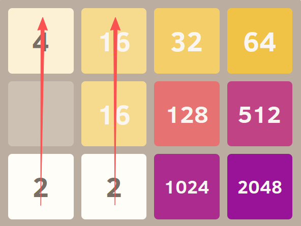 

此处不走右，走上，然后任意位置出2均走下

### 5.两排带回传64

这种情况只有在合成第三个大数（4k+2k+1k)即以后需要使用，范围较小，不作介绍

铺垫部分参考两排带回传32即可

## 四、两排16及其铺垫

### 1.两排8与其铺垫

    

此处走上，追求更多的数，且此处不容易灭顶。所以上图走上。

  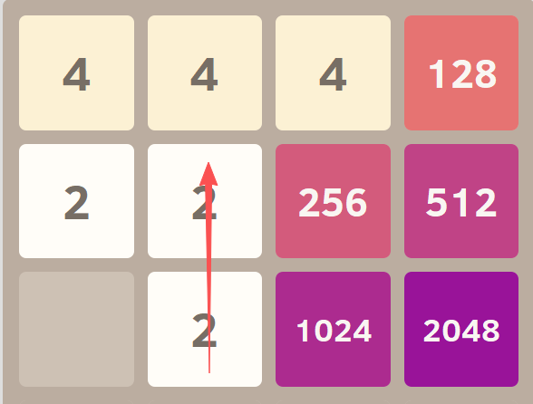

A1出2，此时走上卡格

如果出2（无论哪格)，继续走上然后右

    

B1出2，此时走右（不然出4很麻烦），然后希望2出在1-2号位继续走右

    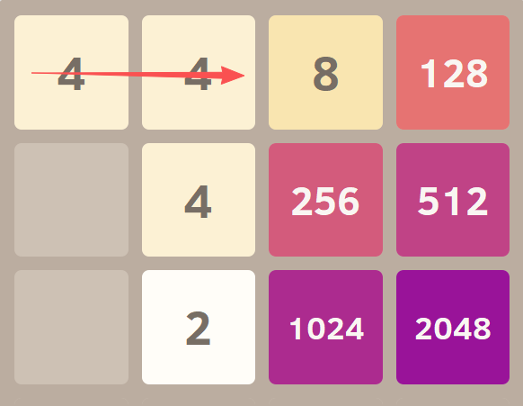

此时走上，无论2出哪都走右，铺垫 **形3＆4**

  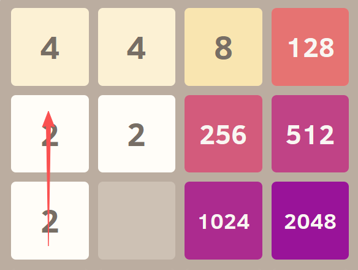  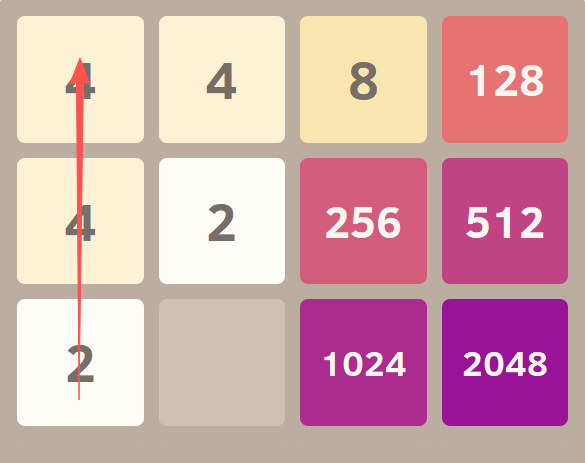

此时走上，如果顶层出2则继续上（否则走右），顶层再出2再上（否则走右），铺垫**形1＆2**

  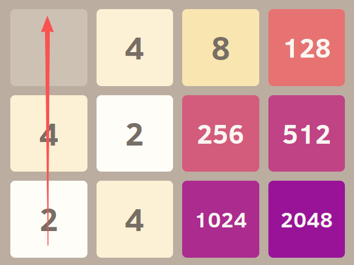  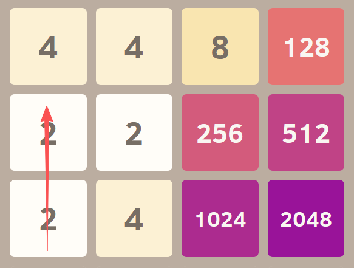

图一走右，然后追求顶层卡242形

### 2.铺垫两排16

两排16的铺垫好坏决定了成功率的高低

两排32几乎沿用两排16的铺垫（部分变招已指出）

⭐

                

铺垫程度好坏从左到右递减，以上最优解均为右

从左到右记作**形1**~**形9** ，需熟记上述形状

铺垫形走法：

**1.** 

   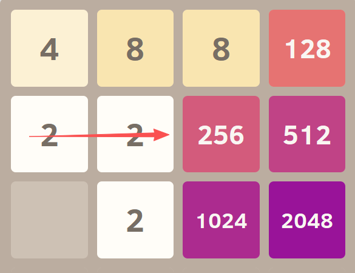

图1走上，如果2出在次顶层则走右 形成**形6**

    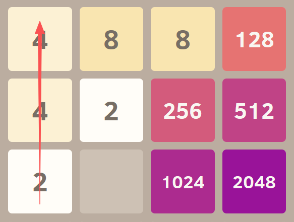

如果2出在顶层则为好形，先走上。如果2继续出在顶层则走上，形成**形1**；如果2出在次顶层，走右形成**形2**

tip:

      

值得注意的是：铺垫两排32时，此时需要走上（2出在次顶层也是走上），追求图二的好型

**2.**

  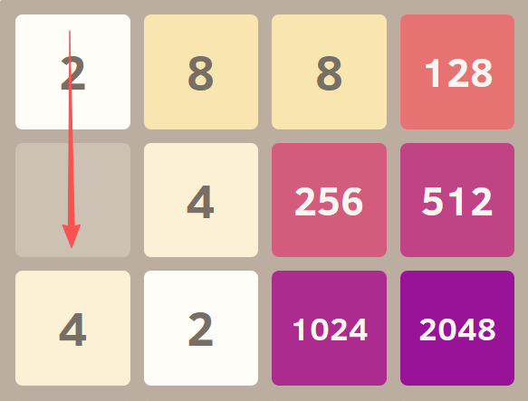  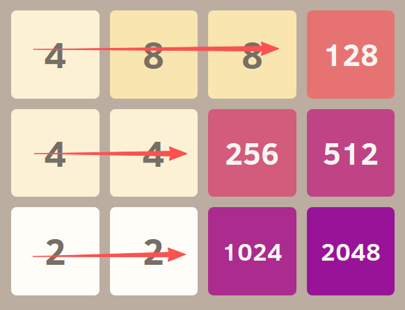

当出现以上局面时，走下，如果2出A2，形成**形4**

如果出在A3（图2）走下上，形成**形3**，然后走右，否则需要赌1%

**tip:**

在图3的情况下，铺垫两排32时不应该急着走右，应该赌1%，走上上再右，形成以下好型

  

### 3.禁回传两排16  

按以上铺垫分析两排16

#### 1. 形1 

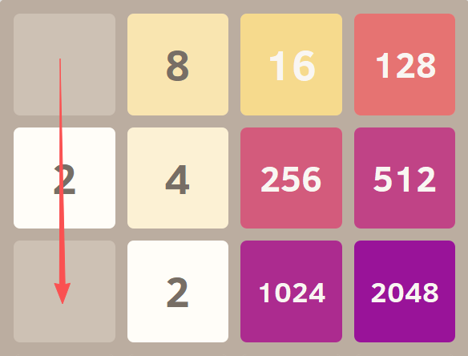  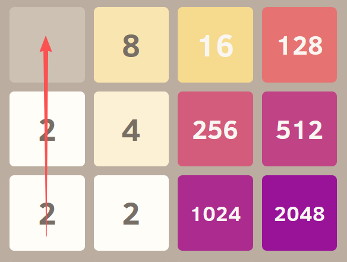    

先走下，然后上

图3走右。这个形状只有两排64的时候才走下

#### 2.形2 

**(1)**

    

A1出2，走上，出在次顶则继续走上，出在顶层则走右

**(2)**

    

B3出2，上右形成反向48

#### 3.形3

右下上。记得一定先下不然4出在A1很难办

#### 4.形4

  

如果2出在次顶层，走上，

然后如果顶层出2则走上，次顶层出2则走右。

如果2出在顶层，先上。若2在顶层则继续上，若出在次顶层则右

#### 5.  形5（变化最多） 

这个形状比较有意思，只有在铺垫一排8（即两个4入缝）且非双缩时才走上，其余均走右
且该形状不会在铺垫一排32和一排64时出现

 

顶层2  次顶层三个2，走下

**（1）**

  

2出在次顶层，走下

**（a)**

    

A3出2，走右，然后下上右，做z形84

**(b)**

    

如果次顶层出2，上右，形成z形84

**（z形84-铺垫两排32）**如果形成图2此处走上，不然有可能填角失败

  

此处走上卡数，然后直接右

如果B1是4则不需要卡数（**形3**的变化），因为顶层单4填数比42要好

  

如果遇到此情况，直接右比上卡数更好，原因是对灭顶的抗性更高（像图2就不好）。当然此处差别并不大

**(c)**

  

A2出2，此为最糟糕形状，走上，形成靠墙48

  

图2，48靠墙 此时走上。若顶层出2走上（顶层出8，次顶层留4是好形），次顶层出2 则走右

  

走右，然后上

  

此处要走右右，铺垫两排32（如果缝里是16 32则走右上右）

（i)

  

运气不好会出现小滑出，先下，无论出什么数都走上

一些坏4有可能导致填角失败，但纯2分支不会

(ii)

    

844有可能出现大滑出，胜率最低。如果运气很好2出在A1。此处走右
(两排32则走上，可以类比84222的情况)

(iii)

  

大滑出是最糟糕的形状之一

如果下移后2出在顶层那很幸运，如果次顶层出2，将面临16无法填进。后续需要先将16放在1号位，然后强填16和32（具体细节见第五章）

**(2)**

    

A3出2，此时先右，然后无论出什么数都走上

图三 2出在A2，走上。其余情况均走右

**(3)**

    

A2出2，先走下，无论哪个位置出2都走上，大概率形成z形84

#### 6.  形6、形7、形9    

**形6**在final128时几乎在任何时候都是走右

  

如果2出在A1，则先走右再上，防止坏4

    

出在A1 A2则走上。然后若A2出2则走右

#### 7.   形8 

铺垫两排32和两排64时走上，其余走右

出数位置A1优于A2优于A3

**(1)**在A1 A2出2则走右，形成**形4** or 唤鸡形 

   

唤鸡比822更好，先走下再走上

(2)在A3出2则走下，与**形5**的变形（1）相同

 

该形状已在形5中讨论过

## 五、填缝细节＆填缝不进

填缝细节的话一般而言不会掉很多点。但如果填的不好的话可能会出现被迫赌灭顶，或者填缝不进。

本章前半章先讲解填缝细节，后半章讲解如果出现意外无法填进如何处理。

### 1、双缩填法

  

此时走右，防灭

  

此时走上再走右

    

如果A1的2在B1也要走上，然后走右，不卡8入缝

  

此时走上再走右

### 2、单缩填法

  

直接走右防灭。如果走上，2出在A2则很难办

       

这里走上更好。笔者猜测是因为灭顶概率低，且留B列一列2填8不好。

图2直接走右，是因为防灭

      

此时不需卡，直接右即可，822填8很优

2出在顶层，走上再走右

  

走上卡数再走右

**赌灭抉择：**

    

赌灭抉择：如果填缝有概率会灭顶，而不填的话有概率会填不进

填8有时候会出现赌灭抉择

记住，一步4灭随便赌，一步2灭永不赌（图一中把64改成16或32也是一样的走法）

**赌灭填缝：**

  

此处走上，连填比填不进要好

**填缝不进**

填缝不进一般表示某个大数已经在两排合出了，但是因为一些原因（可能是滑出或者被迫防灭）填缝失败

这种情况还是很多见的。当然最常见的还是铺垫过程出了个4，然后留在上面消不掉了……

一般而言是需要多赌的，但如果形势不对就赶紧转L吧hhh

下面分别介绍填8不进和填16不进

### 3、填缝不进（填8不进）

填8失败的情况还是比较好处理的，只要处理得当大概率还是能够填回

#### （1）小不进

笔者对小不进的定义是：填缝不进，但不会受到C3 D3的合并缩进而造成影响

小不进的填进概率很高，变化也较少

  

该图是很不好的形状，走下再走上，然后右赌这个对半

如果赌到对半那么纯2分支可以直接填8再填16

如果没赌到，合出16很坏了，需要参考填16不进

   

图1，走上比走右好很多。

图2直接走右，不要走上。走右要么能把8放回3号位，要么能直接填。而走上往往意味着要赌对半填

#### （2）大不进

笔者对大不进的定义是：填缝不进，且会受到C3 D3的合并缩进而造成影响（比如下面这种糟糕的局面）

 

(这里是走右，连消不能进还不如不连消)

大不进很多时候是因为铺垫太差+赌1/2 or 1/3失败

大不进往往有些麻烦，但合并缩进也不完全坏，有时候连消往往能带来意想不到的效果

首先，我们得理清楚，什么时候可以把8硬填进去：

外仓是以下数的时候

①44 ②88 ③16 8 ④16 16 ⑤32 8 

其中②③⑤能吃到连消的机会

    

其中②可能可以做8888入缝如下图：


为了做这个形状，需要卡数卡满一点

（而其余情况为了能赌对半可能要少卡数，如下图

 

32 16之后可以直接做两排16（如果还不行估计16都出了……）

此外注意以下两点：

1.一般而言，有赌对半or赌1/3的机会都**尽量赌**

2.B1填成4往往不好

其余细节不作过多介绍

### 4、填缝不进（填16不进）

填16不进非常糟糕，如果只是8格128阶段，可以考虑直接转42L处理

如果是8格256，还是得再努力赌一赌

#### （1）小不进

接上回填8不进部分，如果赌对半失败，会形成下述局面

  

走右上右，需要先赌赢一个对半，再赌一个1/3

  

第一个对半赌输，走下，接下来需要连续赌赢两个对半

如果还是输了的话，带缓做一排8，成功率也不低

 

此处走上，否则要赌对半

#### （2）大不进

同样，我们得理清楚，什么时候可以把16硬填进去：

外仓是以下数的时候

①88 ②16 16 ③32 16 ④32 32 ⑤64 16

其中②③能吃到连消的机会（⑤的话不太现实）

这个机会看来也不少。但事实真如此吗？

一般而言得看B1是什么数

B1是2缓冲最好，可以继续硬填

B1是4缓冲也好，继续填

B1是8，大哥别赌了，一排8发4得gameover了，准备转L吧

    

（这里的D3 32换成16也基本是一样的走法）

图1图2不走右卡数，准备赌两个对半（如果走上，出4还很麻烦）

图3走下，如果赌到对半，接下来只需要赌1/3，而没赌到对半也能把4拉上去

 

这里走上。如果出4，还能16 16 16 16填缝。如果出2，则追求连填

#### （3）转42L

 

这个局面下赌1/3失败，B1还被填成了8 。被发牌员做局了不要红温，冷静下来，还得转42L

    

图1走下，如果2出在A3则继续走下。如果2出在A2，走左

图3，无论2出在哪都先走右再走左左，然后转成42L

## 六、42L-128

相比426，42L在合成128以及256时就略显乏力了。

但是42L更通用，426填缝失败时往往意味着被迫转42L。所以学习42L的基本走法还是很有必要的。

这里的L和44的L，33的L不同，是非对称L，横轨有4格位置，纵轨只有3格（回忆一下哪条是横轨哪条是纵轨）

同样，出法有两种：**纵轨堆数**＆**横轨堆数**（简记：**纵轨**＆**横轨**）

想想，4格一排8和3格一排4哪个难？4格一排16和3格一排8哪个难？

因此，纵轨合数具有更高的优势，而横轨储存空间大，储存具有优势。

在L-32和L-64时，我们希望能将大数都堆进横轨，而纵轨用做工作区。也即横轨堆数的方法。

而16 16 8 8，32 32 16 16则思维更跳跃，把第二大数提前运作到了C3（横轨内部的位置），提前将横轨划归于储存，是成功率很高的走法，这在后续攻略均会涉及。

    

首先正常做42L-64，我们很容易走成图1，然后走右

图2中 2发在A3则继续走右，如果2发在B3，最优解是上。然后再走右

    

很容易走成上图1，然后走右走到不能走为止，再走下

 

如果顺利的话，会走成**8444**，这个时候走上，铺垫成16 16 8 8路线

   

2发在A2，走右再走左，也是一种好的铺垫

### 1.16 16 8 8路线

首先走成8 8 4 4

#### （1）卡满

    

如果运气好，给到了卡满，走法如上

 

图1不要走上，不然连消需要看对半。直接走右（如果上一步A3出4也不要连消，应当走下，如下图）

   

（出4的情况都直接走下，纵轨填8解4很安全）

    

如果运气很好可以走成上图，走下下上，填8，形成16 16 8 8

这个局面成功率非常高

   

走上上填8，再填4，然后传16和32准备铺垫L2-256

#### （2）卡满失败

有时候运气不好，一直不发卡满

    

图1走上，连消威胁不大。

图3还在发坏2，只能转常规路线（下面会讲）

 

运气不好还有可能走成以上局面

   

图1走下不连消，希望能纵轨填8

图2走右，希望能赌到对半

以上均有可能出现滑出废一格

### 2 常规路线

常规路线指的是无法铺垫16 16 8 8 。被迫按部就班填8→填16→填32

    

8444有时候不能顺利的走成16 16 8 8，比如上图。

这里有一个对半

#### （1）纵轨转横轨

纵轨转横轨指：16从纵轨出，32从横轨出

   

如果2出在A1，则右左填84

  

铺垫成以上局面，然后一直走右，直到出4或者8422或者不能走为止

出4的情况灵活应对。如果顶层8422则非常好，走上填16，完美铺垫L-32

**出4的处理*：**

 

A3出4，走下，有两个对半能赌上去。如果都输了，也很好解

 

B3出4，则走左下左上铺垫横轨

#### （2）横轨转纵轨

横轨出完16的同时，希望能继续铺垫横轨。如果失败，被迫转纵轨32

  

如果2出在B3，则走下。如果2再出A2则走左，转化成（1）的情况

图2运气不好，出在了A3，则走上

   

将B3和C3填成88，然后填16

   

上图走右，有个对半。如果运气很好，2发在B3，则走上，清出纵轨，16进横轨，非常好。

    

对半赌输只能走左，使纵轨用于储存

然后期望横轨出16。两个8有缩进缓冲，成功率不低。

## 七、42L-256

如果在最后的4k残局填缝失败，很遗憾，42L还是成为了最后的选择

42L-256的成功率是0.44，虽然不高，但是只要走的好，希望还是很大的。

合128的方法参考42L-128即可

首先推荐走出16 8 8，如下

   

一直走右，直到出4 or 不能走 or 8422

### 1. 32 32  16 16 路线

      

     

没什么特别好讲的。可能出坏4的地方很多，请灵活应对。

如果运气很好都是2和好4，需要注意何时该进8，何时该进4

规则怪谈：

1.如果不能进8，则进4

2.如果进8出现连消，则进4

3.如果进4出现连消，则进2

4.如果没有走出16 16 32 32，则只有在4 4 4 8时才进8

5.如果走出了16 16 32 32，则可以进8

讲完了，good luck

### 2.常规路线

#### （1）横轨铺垫横轨

   

对半没赌到，有的时候直接填不了了

    

  

只能改走以上路线，强行横轨铺垫横轨。其中任意地方出4都是很致命的

#### （2）纵轨

   

有些坏4害人只能转纵轨（如上）

但纵轨胜率也不算低。图1的胜率有40.8%

之后用44-L128的走法就行了，此处只罗列部分细节

     

    

本攻略完结

THANK YOU FOR READING！！

-----------------

作者 - 闪电小雷友 - verse昵称：P-lghtnire

作者3*4PB：

 

祝大家都能打出好成绩~赌2赌4赌对半全赢

